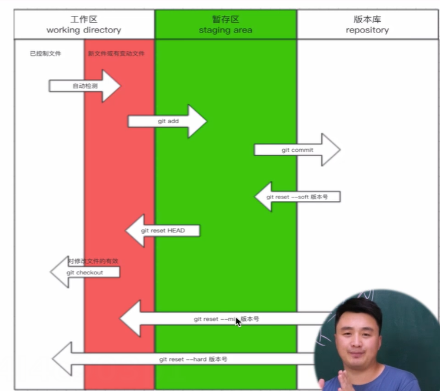
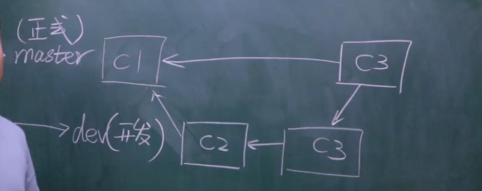

工作区
暂存区
新版本

第一阶段：自己写
git init
git add .
git commit
git log

第二阶段：拓展新功能
git commit -m "显示功能"

第三阶段
回滚到之前的版本：
git log 查看版本号5a0113b094f93070b0b28e229ff2df5eb76cb380
git reset --hard  版本号

回滚到之后的版本
git reflog 
得到109e9a0 
再git reset

总结：

分支
方便修紧急bug
分支起名字：主干master，分叉分支1可以教dev，分叉分支2可以教bug
分叉分支可以隔离环境

查看分支
git branch

创建了dev分支
git branch dev

切换分支
git checkout dev
git checkout master

合并到master
在master: git merge dev
（要注意谁合并谁，要切换到要合并的版本）
合并可能产生冲突，要手动修改冲突文件的冲突部分

删除分支
git branch -d dev

开发工作流

Github/gitlab
创建仓库
本地代码推送

